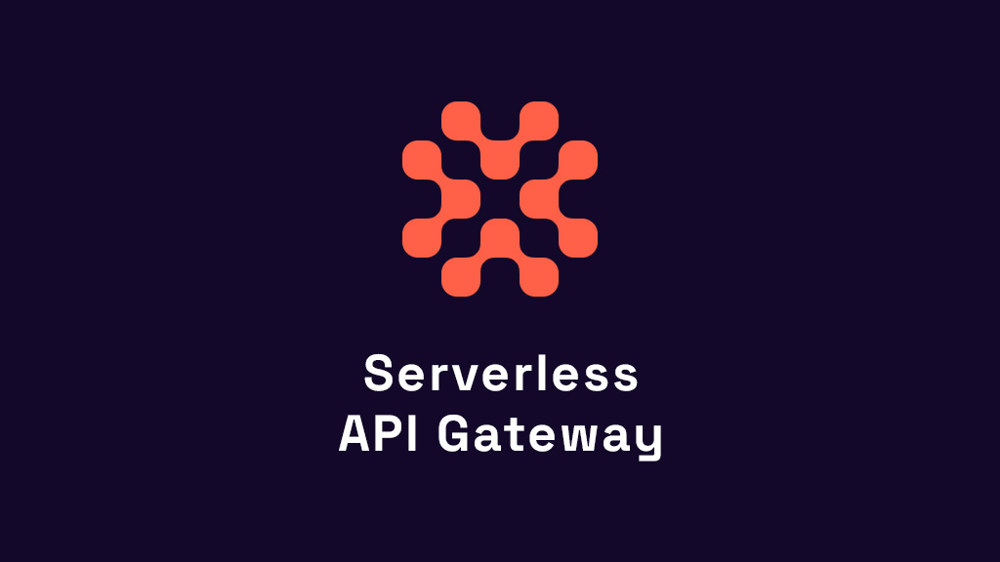

	
    <h1> 
        <strong>Serverless API Gateway</strong>
    </h1>

Welcome to the Serverless API Gateway, an innovative tool designed to streamline your API management tasks using the powerful capabilities of Cloudflare Workers.

## Features

- **JS Workers**: Write serverless JavaScript workers that intercept and modify your API requests and responses on the fly.
- **Routing (Path and Method)**: Simplify your API architecture with flexible path and method-based routing for directing traffic to the appropriate endpoints.
- **CORS (Basic)**: Manage cross-origin resource sharing settings with ease, ensuring your APIs can securely handle requests from different origins.
- **Auth (JWT)**: Secure your APIs by implementing JSON Web Token (JWT) based authentication to validate and manage user access efficiently.
- **Service Binding**: Bind your API to a service as Workers, so you can use the Workers capabilities within your API.
- **Value Mapping**: Map values from sources to destinations, allowing you to easily transform your data.

## Motivation

APIs are pivotal in the landscape of modern applications, but they bring forth a unique set of challenges regarding security, routing, and overall management. The Serverless API Gateway emerged from the need to address these issues in a reliable, manageable, and cost-effective way. Built upon Cloudflare's serverless infrastructure, this project provides developers with a lightweight yet robust toolkit that adapts to the unpredictability of internet scale and traffic. Our mission is to empower developers to securely and efficiently manage their APIs without the overhead of managing infrastructure.

For detailed setup and usage instructions, please see the [Serverless API Gateway documentation](https://docs.serverlessapigateway.com).

## Contributing

If you want to contribute to the project, you can start by checking the [contributing guidelines](CONTRIBUTING.md).

## Acknowledgments

A shoutout to the contributors, community members, and the maintainers of Cloudflare Workers for their support and inspiration in making this project a reality.

The Serverless API Gateway is not just another API tool; it's created by developers, for developers, with the vision of making API management a breeze. Let's build together.

## Support

I'm always happy to help with any questions or concerns you may have. Feel free to reach out to me from on [Twitter](https://twitter.com/irensaltali) or [LinkedIn](https://www.linkedin.com/in/irensaltali/).

If you need a more extensive support you can always book on [Superpeer](https://superpeer.com/irensaltali/-/serverless-api-gateway)

# Companies that use Serverless API Gateway

	

Let us know if you are using Serverless API Gateway and we can add your company here.

# Contributors

# Feeback Survey

Please take a few minutes to fill out the [feedback survey](https://r39ra55b0sl.typeform.com/to/ex8HMyTH) to help us improve the Serverless API Gateway.
